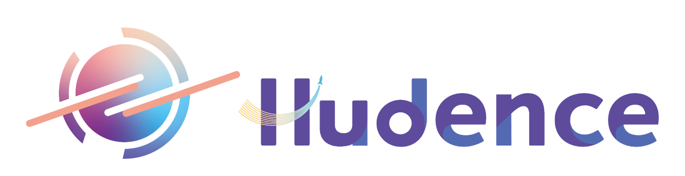

 # Hudence 艾登星官網



## 專案簡介

這是 Hudence（艾登星）科技教育公司的官方網站，使用 Next.js 14 和 TypeScript 開發，具有現代化的設計和豐富的動畫效果。

## ✨ 特色功能

- 🎨 **現代化設計**: 使用 Tailwind CSS 打造美觀的用戶界面
- 🌊 **流暢動畫**: 基於 Framer Motion 的精美動畫效果
- 📱 **響應式設計**: 支援各種設備尺寸，提供最佳瀏覽體驗
- ⚡ **靜態網站**: 完全靜態化，適合部署到 GitHub Pages
- 🎯 **SEO 優化**: 完善的 meta 標籤和結構化數據
- 🔧 **TypeScript**: 提供完整的類型安全保護

## 🚀 技術棧

- **Framework**: Next.js 14
- **Language**: TypeScript
- **Styling**: Tailwind CSS
- **Animation**: Framer Motion
- **Icons**: Lucide React
- **Deployment**: GitHub Pages

## 📋 網站結構

### 主要頁面區塊

1. **首頁 Hero**: 品牌介紹和主要價值主張
2. **關於我們**: 公司使命、價值觀和統計數據
3. **服務項目**: 六大核心服務領域
4. **課程介紹**: 分齡分級的課程內容
5. **學生作品**: 優秀學生作品展示
6. **最新消息**: 公司動態和新聞資訊
7. **聯絡我們**: 聯絡資訊和諮詢表單

### 組件架構

```
app/
├── components/
│   ├── Header.tsx       # 導航頭部
│   ├── Hero.tsx         # 首頁英雄區塊
│   ├── About.tsx        # 關於我們
│   ├── Services.tsx     # 服務項目
│   ├── Courses.tsx      # 課程介紹
│   ├── Portfolio.tsx    # 學生作品
│   ├── News.tsx         # 最新消息
│   ├── Contact.tsx      # 聯絡我們
│   └── Footer.tsx       # 頁尾
├── globals.css          # 全域樣式
├── layout.tsx           # 根佈局
└── page.tsx             # 主頁面
```

## 🛠️ 開發指南

### 環境要求

- Node.js 18 或更高版本
- npm 或 yarn

### 安裝與運行

1. **安裝依賴**

   ```bash
   npm install
   ```
2. **開發模式**

   ```bash
   npm run dev
   ```

   開啟 [http://localhost:3000](http://localhost:3000) 查看結果
3. **建置生產版本**

   ```bash
   npm run build
   ```
4. **導出靜態檔案**

   ```bash
   npm run export
   ```

### 部署到 GitHub Pages

本項目已配置自動部署到 GitHub Pages：

1. 推送代碼到 `main` 分支
2. GitHub Actions 會自動建置並部署
3. 網站將可在 `https://[username].github.io/Hudence` 訪問

## 🎨 設計系統

### 色彩配置

- **主色調**: 藍色系 (#0ea5e9)
- **次要色**: 紫色系 (#a855f7)
- **中性色**: 灰色系配色

### 動畫設計

- **進場動畫**: 淡入和上滑效果
- **懸停效果**: 縮放和陰影變化
- **背景動畫**: 流動的色彩球體

## 📱 響應式設計

網站支援以下斷點：

- **Desktop**: 1024px+
- **Tablet**: 768px - 1023px
- **Mobile**: 小於 768px

## 🔧 自定義配置

### 修改公司資訊

在各組件中更新以下內容：

- 公司名稱和 Logo
- 聯絡資訊
- 課程內容
- 服務項目

### 添加新功能

1. 在 `app/components/` 中創建新組件
2. 在 `app/page.tsx` 中引入組件
3. 更新導航選單（如需要）

## 📄 授權

本項目為 Hudence 艾登星科技教育有限公司所有。

## 🤝 貢獻

歡迎提交 Issue 和 Pull Request 來改善這個項目。

---

**© 2024 Hudence 艾登星科技教育有限公司**